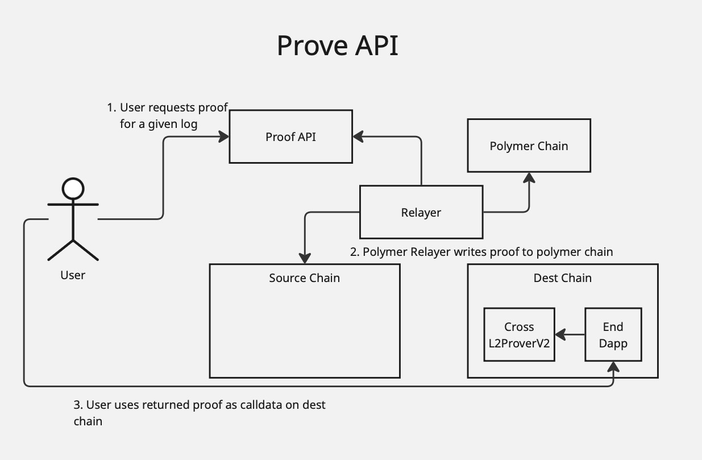
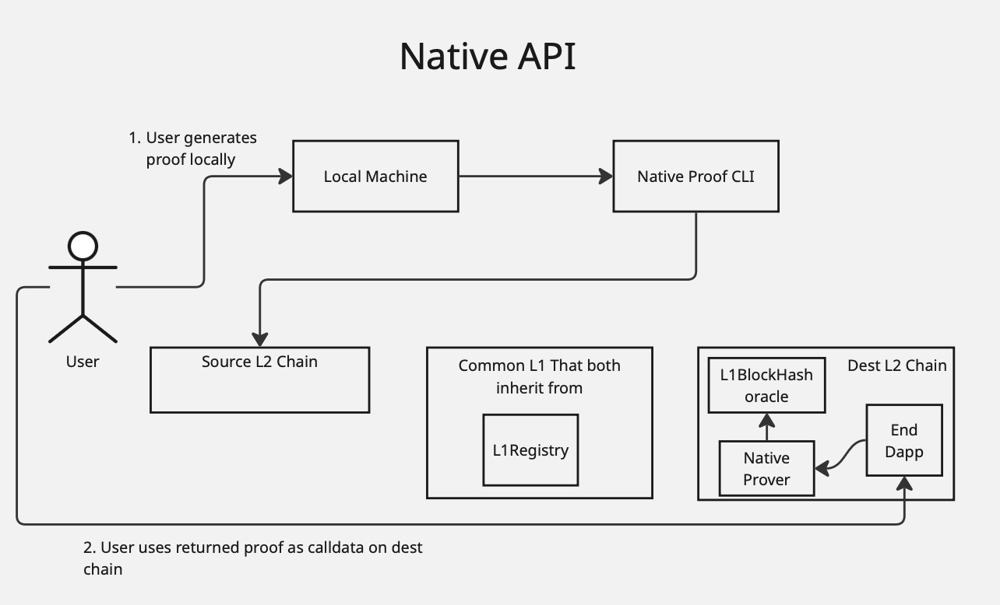

# Polymer Prover Contracts

This project includes the core smart contracts for Polymer's Proof API, and few demo contracts that simulate testing and serve as a template for integrating dapp devs, and an npm package to aid with deploying and sending transactions to deployed contracts.

## Repo Structure

All contracts internal to this project are in the `contracts`. This directory contains the following subdirectories:
- `core/`: The contracts that are core to the polymer proof api protocol & fallback methods. These are the contracts that will be deployed and used in production. 
    - `prove_api` contains contracts that are useful for cheaper proofs across between any supported chains, which use Polymer chain as an hub for proving state. 
    - `native_fallback` contains contracts which are more expensive but useful for doing proofs without polymer as a hub chain (direct src to dest) between chains which inherit from the same L1. This can be useful as a fallback if the normal `prove_api` path is not working.
- `interfaces/`: Interfaces for core and testing contracts.
- `libs/`: Libraries used by the core contracts. Some of these are used by contracts in production.
- The `utils/`, `base/`, and `example/` directories all contain contracts that are not core to the protocol. These contracts are used only for testing or as templates for dapp contracts that will integrate with the protocol. 

# Core Contracts
## Prove API 

**Note*: `CrossL2Prover` is now deprecated and all proofs should only go through `CrossL2ProverV2`. 

The Prove API contains the default path for proving events on counterparty chains. Unlike the fallback prover, this path supports proving counterparty chain events, and not storage.  

The `CrossL2ProverV2` contract is completely permissionless and has no access control.  

More details can be found here: https://docs.polymerlabs.org/docs/category/prove-api-1

## Native Fallback 

Native Fallback contracts are useful when proving storage and reducing dependency on polymer as a chain. This can be a useful fallback for the default prove api path. Instead of going through the api, a user uses a CLI to generate a proof which can be called on the `NativeProver` contract deployed on the destination chain. This proof is independent of polymer, and only requires setting rpc urls between the source, destination, and l1 chains. 

## A Walkthrough
This section gives a concrete walkthrough to better illustrate the role each component plays.

For this, we are assuming we have a smart contract on chain A who'se storage we want to prove on chain B. Both A and B are L2s which settle on a common L1 - we can call this chain X.

### 1. Deploy contracts
Before native proofs can be used, the following contracts need to be deployed: 
- Registry.sol on chain X that all the L2 chains settle to. This will be managed by a multisig which ideally would be operated by most supported chain operators. 
- NativeProver.sol on chain A and B.  
- The native Prover.sol points to a `ISettledStateProver` which should also be deployed on chain A and B. This is an abstraction over different settling versions and mechanisms that rollups use to settle onto the l1. 

### 2. Update the Registry
The registry on chain X should be configured with information about chain A and B through calling `updateL2ChainConfiguration`. This config includes information on how each chain settles onto the l1, which will be stored on chain X in storage, and can thus can be proven itself and used to prove information about chain A and B. 

### 3. Generate a proof
In theory, proofs from these contracts can be generated by any user through directly querying storage proofs through the relevant chains' rpcs and encoding data as expected, but we also provide an [open source cli tool ](https://0b451bff.solvent-app.pages.dev/vaults) for generating these proofs that can be run on a local machine.

### 4. Call the proving method on destination chain (B)
The proof generated by the cli tool will produce calldata that can be used to call `proveL2Native` and `proveLLNative` methods. In our example, chain A and B both settle onto chain X, so we would use `proveL2Native`. `ProveL1Native` would be useful for communicating across Chain A and X or chain B and X.  

Under the hood, `proveL2Native` does the following: 
1. Prove the L1's world state root against it's `L1BlockInfo` contract. Most l2s provide some trustless way of accessing the L1's information in the execution environment, so this contract often can be accessed and relied on trustlessly.
2. Once we have an idea of what X's global state is, we can now use it to first prove the configuration that chain A and B were configured with. If we skipped this step, griefers could pass in arbitrary configurations and e.g. setup their own contracts to spoof state outputs to trick our contracts. 
3. Once we have proven what the configs for each of our chain is, we can access the global state of the chains themselves. In this case, we want to prove a state on chain A, so we first prove the global state of chain A. 
4. Similar to the above step of proving the registry's state on chain X, we use the same process to prove the state on chain Against the global state root. The method returns information like the state hash itself.

# Building Contracts and Testing
This repository uses Foundry for testing and development of smart contracts, and hardhat for deploying.

## Deploying Contracts
All deployments can either be done through the command line, or through javascript code through importing modules. 
After each deployment, deployment files are saved in deployment artifacts as json files, structured similar to how [hardhat deploy stores its deployment files](https://github.com/wighawag/hardhat-deploy). 

Before deploying, the accounts used to deploy and any constructor arguments must be configured. This configuration can either be read from a yaml file or set through environment variables (see the sections below on how to configure each deployment).
