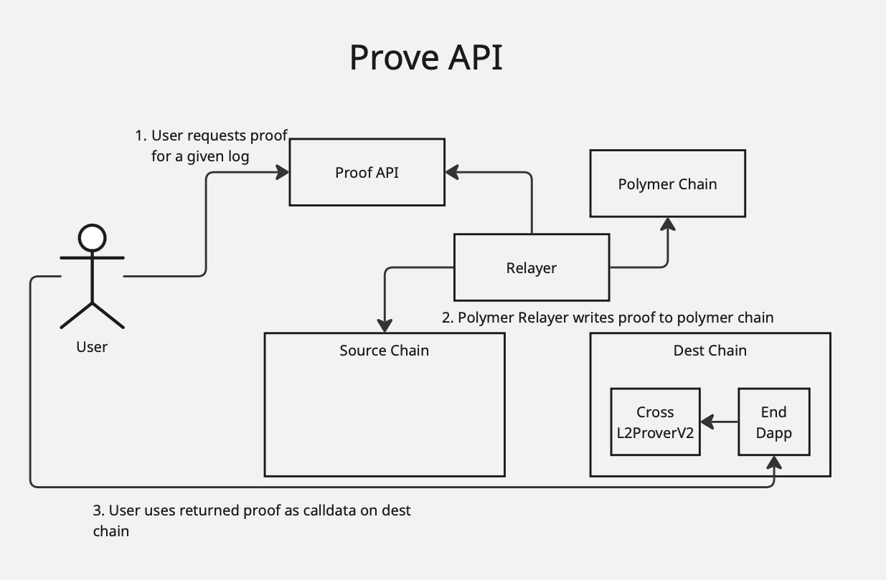

# Polymer Prover Contracts

This project includes the core smart contracts for Polymer's Proof API, and few demo contracts that simulate testing and serve as a template for integrating dapp devs, and an npm package to aid with deploying and sending transactions to deployed contracts.

## Repo Structure

All contracts internal to this project are in the `contracts`. This directory contains the following subdirectories:
- `core/`: The contracts that are core to the polymer proof api protocol. These are the contracts that will be deployed and used in production. 
    - `prove_api` contains contracts that are useful for cheaper proofs across between any supported chains, which use Polymer chain as an hub for proving state. 
- `interfaces/`: Interfaces for core and testing contracts.
- `libs/`: Libraries used by the core contracts. Some of these are used by contracts in production.
- The `utils/`, `base/`, and `example/` directories all contain contracts that are not core to the protocol. These contracts are used only for testing or as templates for dapp contracts that will integrate with the protocol. 

# Core Contracts
## Prove API 

**Note*: `CrossL2Prover` is now deprecated and all proofs should only go through `CrossL2ProverV2`. 

The Prove API contains the default path for proving events on counterparty chains. This path supports proving counterparty chain events, and not storage.  

The `CrossL2ProverV2` contract is completely permissionless and has no access control.  

More details can be found here: https://docs.polymerlabs.org/docs/category/prove-api-1

# Building Contracts and Testing
This repository uses Foundry for testing and development of smart contracts, and hardhat for deploying.

## Deploying Contracts
All deployments can either be done through the command line, or through javascript code through importing modules. 
After each deployment, deployment files are saved in deployment artifacts as json files, structured similar to how [hardhat deploy stores its deployment files](https://github.com/wighawag/hardhat-deploy). 

Before deploying, the accounts used to deploy and any constructor arguments must be configured. This configuration can either be read from a yaml file or set through environment variables (see the sections below on how to configure each deployment).
